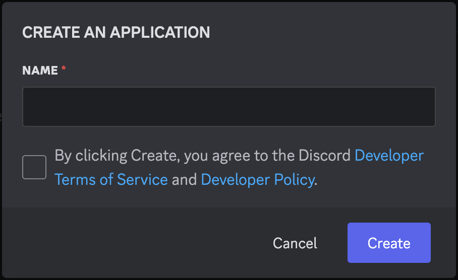
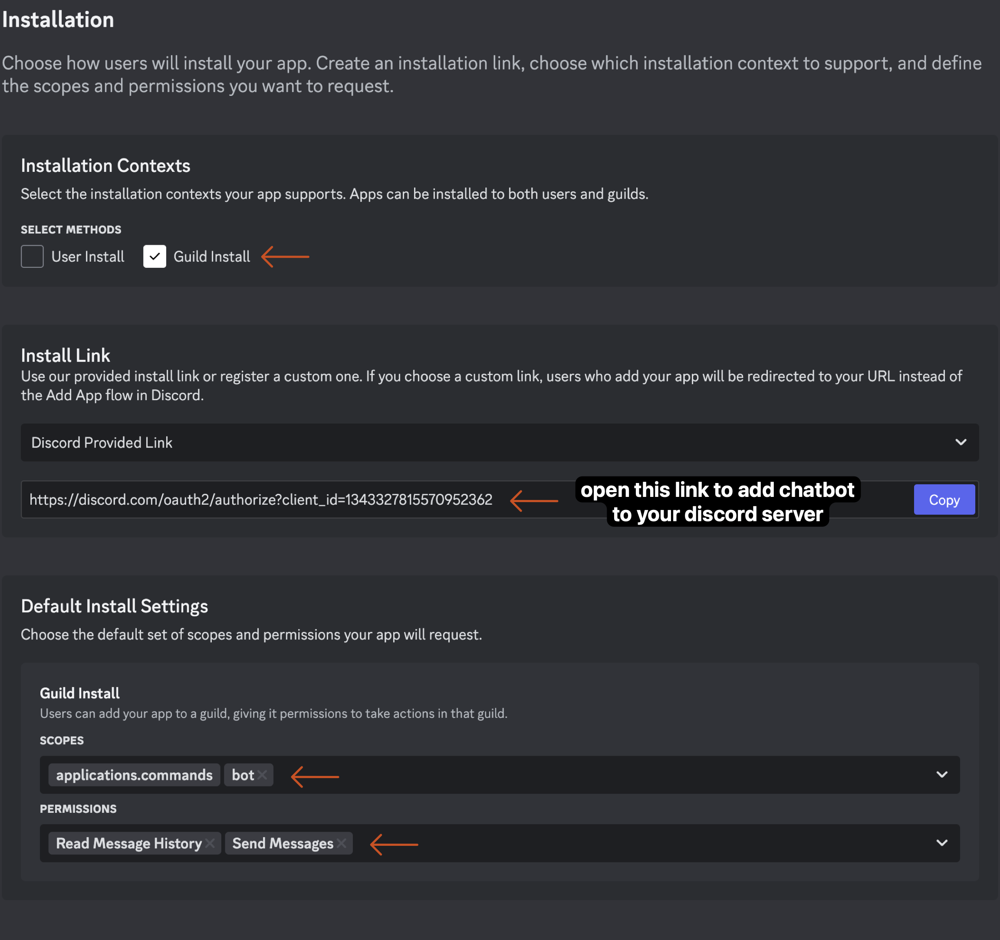
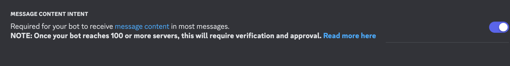
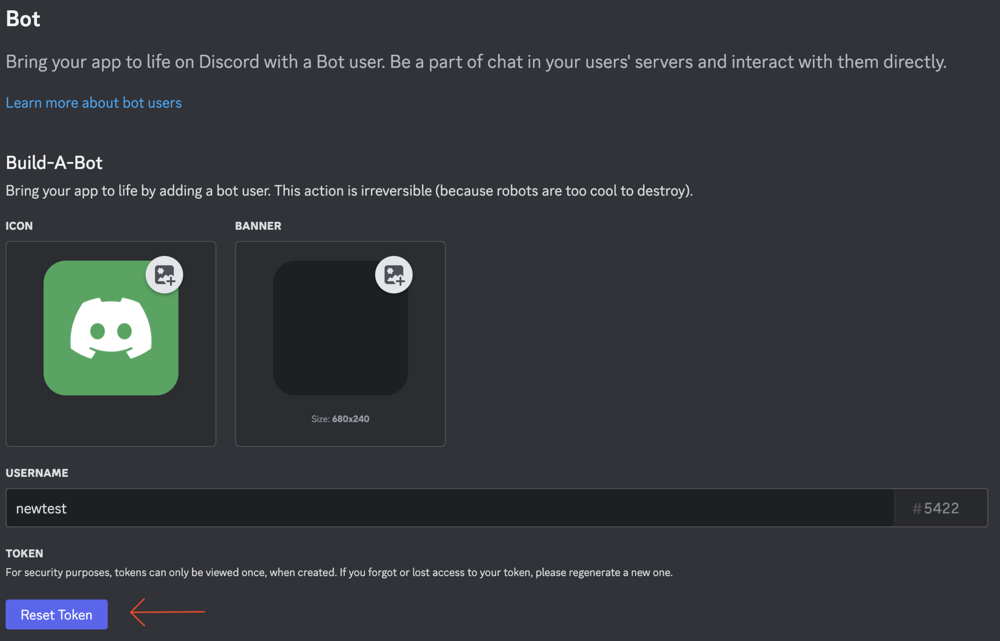

# v0.0.1-alpha OpenRouter Discord chatbot 🤖


a minimal open source discord chat bot with chat context and seamless switching of models enabled by the OpenRouter API.

## features so far

| command              | description                                        |
|----------------------|----------------------------------------------------|
| `!ai <message>`      | Command to chat with the AI model                  |
| `!ai-model <model-id>` | Command to switch between OpenRouter supported models |
| `!ai-model print`    | Command to print available OpenRouter model-ids    |

- uses chat history (last 50 messages in current channel by default) for context
- automatic message chunking for long responses
- rate limiting protection to prevent spam

**WORK IN PROGRESS PHASE** - this is a very early version, feel free to create PRs and issues. I will be adding more features and fixing bugs myself. in case this is getting more traction, I surely need support 🤗

## what you need

- [bun](https://bun.sh) runtime
- Discord bot token
- OpenRouter API Key

## how to install

1. clone the repository:
```bash
git clone https://github.com/sigilbyte/openrouter-discord-chatbot.git
cd openrouter-discord-chatbot
```

2. install dependencies using bun:
```bash
bun install
```

3. create a `.env` file in the root directory with the following variables:
```env
OPENROUTER_API_KEY=your_openrouter_api_key
DISCORD_BOT_TOKEN=your_discord_bot_token
```
to get your OpenRouter API Key, sign up on [OpenRouter](https://openrouter.ai).
to get your Discord bot token, follow the instructions below.

## setup your discord bot

1. create an application on the [Discord Developer Portal](https://discord.com/developers/applications):

2. configure bot installation in installation tab:

Copy the Install link for later.
3. configure bot settings & create your bot token:
    - Enable MESSAGE CONTENT INTENT    

    - Click 'Reset Token' to generate your `DISCORD_BOT_TOKEN`:
    

## configure the .env
in your dotenv file, you will need to set the following variables:
- `OPENROUTER_API_KEY`: Your OpenRouter API key
- `DISCORD_BOT_TOKEN`: the bot token you have created in the Discord Developer Portal

## how to use the bot
after setting everything up in the discord developer portal, open the Install link you copied earlier to add the bot to your server.
#### run bot script:
open your terminal and run:
```bash
cd openrouter-discord-bot
bun run src/index.ts
```

inside the discord server where your bot is active, you can now use the following commands:
#### chat with bot:
```
!ai <your message>
```
#### switch model:
```
!ai-model <model_id>
```
#### print available model ids:
```
!ai-model print
```


## what is planned
the plan is to integrate all **OpenRouter functionalities** in a user-friendly and seemless way.
- [ ] provider routing
- [ ] structured outputs
- [ ] message transforms
- [ ] web search
- [ ] function calling

additionally i plan to add improvements for user-friendliness and integration:
- [ ] message streaming
- [ ] processing of attachments
- [ ] token count and price display

🚨🚨 **note**: this is a wip and the code is not yet optimized for production use. feel free to contact me on [X/Twitter](https://x.com/sigilbyte) to discuss your ideas or contribute to the project. I want to build in public and meet motivated devs on the way to collaborate with.🚨🚨

## License

MIT License

Copyright (c) 2025

Permission is hereby granted, free of charge, to any person obtaining a copy
of this software and associated documentation files (the "Software"), to deal
in the Software without restriction, including without limitation the rights
to use, copy, modify, merge, publish, distribute, sublicense, and/or sell
copies of the Software, and to permit persons to whom the Software is
furnished to do so, subject to the following conditions:

The above copyright notice and this permission notice shall be included in all
copies or substantial portions of the Software.

THE SOFTWARE IS PROVIDED "AS IS", WITHOUT WARRANTY OF ANY KIND, EXPRESS OR
IMPLIED, INCLUDING BUT NOT LIMITED TO THE WARRANTIES OF MERCHANTABILITY,
FITNESS FOR A PARTICULAR PURPOSE AND NONINFRINGEMENT. IN NO EVENT SHALL THE
AUTHORS OR COPYRIGHT HOLDERS BE LIABLE FOR ANY CLAIM, DAMAGES OR OTHER
LIABILITY, WHETHER IN AN ACTION OF CONTRACT, TORT OR OTHERWISE, ARISING FROM,
OUT OF OR IN CONNECTION WITH THE SOFTWARE OR THE USE OR OTHER DEALINGS IN THE
SOFTWARE.
